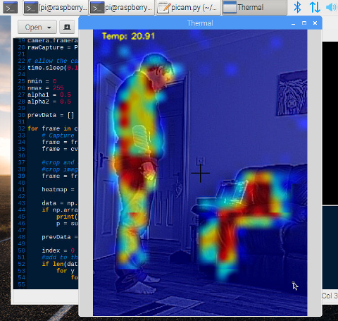

Based on code from: https://github.com/pimoroni/mlx90640-library

An ugly but working hack for the raspberry pi 3 so we can spit thermal data out to a file to be read by other programs.

A thermal cam can easily be implemented in python and openCV by reading this file.

**Above:** Screenshot of myself having got up from the sofa. Note the thermal signature left behind.

**mlx90640_driver.cpp**

When compiled, the executable can be called with: sudo ./mlx90640_driver 8
Where 8 is the required FPS (4,8 and 16 work) 8 FPS is optimal

This program continually overwrites frame data to /tmp/heatmap.csv, where it can be read by other programs.

Note: Modify /etc/fstab to mount /tmp in to RAM, else this program will hammer your SD card!

**thermalcam.py**

An example program that reads data from /tmp/heatmap.csv and generates an image from it.

There are a number of Features and hacks implemented this program:

When I physically mounted the cameras, I mounted them side by side. This means the video and thermal images do not overlap correctly. Originally I considered mounting one camera on a kinematic mount, however the simplest solution was to simply re-align them in software.
The original video camera frame dimensions are set to 288 368 (slightly larger than 240 * 320 that we end up with)
The video data is then cropped in opencv like this: frame = [5:325,10:250] where 5 and 10 are the offsets to crop from respectively.

Ocassionally data is being written whilst we are trying to read and a read error occurs, in that case the last good frame is displayed, rather than just dropping it which is visually annoying.

For an as of yet undetermined reason i2C randomly hangs on the raspberry pi 3, which means the program can no longer retrieve i2c data! Fortunately it turns out that if we merely probe the i2c bus, suddenly everything wakes back up again.The python script checks to see if the current frame of thermal data is different from the last one. If it is not, it just probes the i2c bus at 0x33 (rather than the whole bus which is slow!).

Thermal data is cubic interpolated to give an impression of a higher resolution. The sensor is only 32 by 24 and is scaled to 320 by 240.

The visible and thermal images are combined to provide a meamingful image. Before this occurs edges in the visibe image are enahnced to aid viewing.

The temperature displayed is that of the area under the crosshairs.

Keys:

a & z: Alter nmin (normalization limits) changes color mapping. Lower nmin reduces background thermal noise displayed.

s & x: Alters nmax (normalization limits) changes upper limit color mapping.

d & c: Alters the alpha ratio between the Thermal and the video image.

